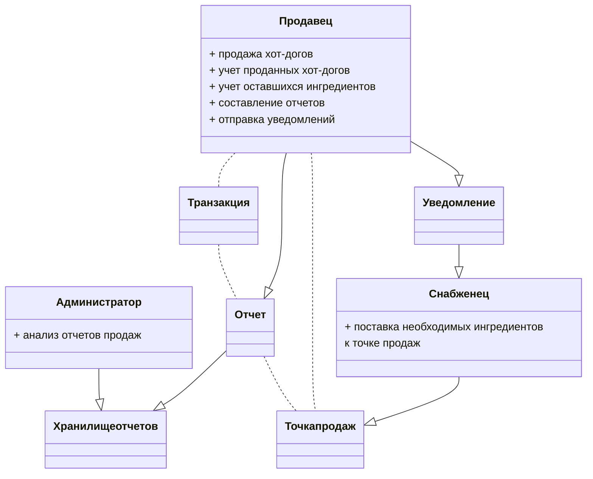
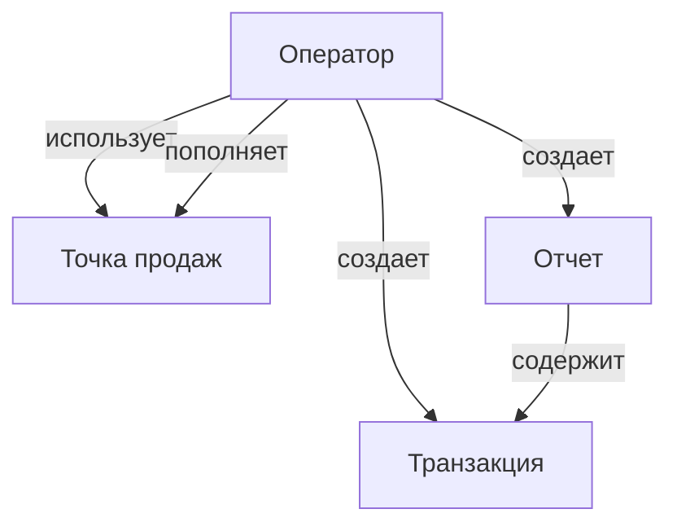
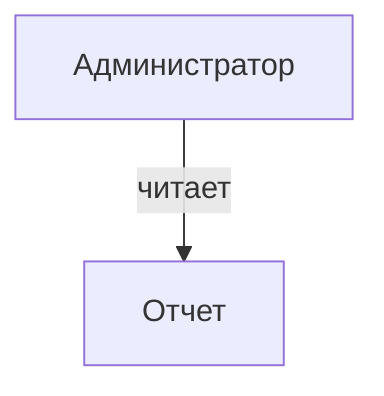
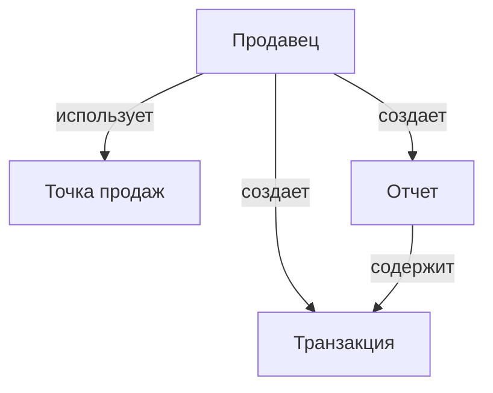
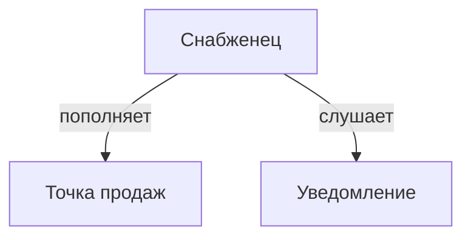

# [Hot Diggety Dog](https://nealford.com/katas/kata?id=HotDiggetyDog)

## Бизнес контекст
Владелец местных ларьков с хот-догами хочет обзавестить системой для управления торговыми точками.

**Пользователи**: ~50 продавцов

**Требования**:
- система должна работать на небольших устройствах (меньше ноутбука), чтобы его можно было эффективно использовать на мобильных точках продаж
- в системе можно делать скидки
- сохраняет время и место продажи каждого хот-дога
- отправляет уведомления сотрудникам, отвечающим за пополнение запасов точек продаж
- интегрировано с соц. сетями, чтобы можно было уведомлять клиентов когда они находятся вблизи точек продаж
- может выгружать отчеты в формате, который умеет читать бухгалтерское ПО

**Дополнительный контекст**:
- вынуждены заняться разработкой, потому что текущие способы отслеживания продаж требуют слишком много ручного труда
- нужно разработать как можно быстрее
- однако, важнее будет разработать систему так, чтобы ее не надо было переписывать в течение 3-х лет
- ограничений по бюджету нет

## Внимание

Данный кейс уже был рассмотрен ранее ([тут](otus-arch/homeworks/july/1/homework.md)).\
Было найдено два архитектурных решения, одно из которых предполагает разработку системы с нуля.\
На нем и будет сконцентрирована данная ADR.

## Модели предметной области
Владельцу бизнеса нужно чтобы:
- создание отчетов продавцов хот-догов было автоматизировано 
- работа менеджеров по снабжению была упрощена
- была административная панель для отчетов

В модели предметной области выделены следующие сущности:

## Функциональная декомпозиция #0

Поскольку заказчику важно разработать решение в кратчайшие сроки, \
возможно имеет смысл две роли (продавца и снабженца) объединить в одну роль оператора.\
Оба взаимодействуют с точкой продаж, есть пересекающийся функционал, который легко разграничивается правами доступа.\
И есть вероятность того что при доработке сущности точки продаж, изменения придется вносить:
- и в коде приложения для продавцов, 
- и в коде приложения для снабженцев 

Контекст по итогу будет выглядеть так:
- контекст оператора
- контекст администратора

## Функциональная декомпозиция #1

Однако, заказчику так же важно чтобы решение можно было не модифицировать в течение длительного периода времени.\
В постоянно меняющемся мире это требование выполнить не представляется возможным, однако можно минимизировать риски.\
Поэтому, разбив модель на большее количество компонентов, можно сильно улучшить модифицируемость решения, \
открыв в дальнейшем путь для множества интеграций сторонних систем со схожим функционалом, если не будет своей команды разработки.

В данном случае ярко выражены три сущности, поэтому имеет смысл декомпозировать все решение по ним на три контекста:
- контекст продавца
- контекст снабженца
- контекст администратора

## Сценарии изменений

- Помимо хот-догов стали продавать мороженое, и теперь один продавец использует сразу две точки продаж 🔴
- Штат сократили и теперь продавец должен сам пополнять точку продаж вместо снабженца 🔴
- С `n` точек продаж понадобилось делать единый отчет 🟡
- Бизнес стал продавать франшизу и теперь сторонним продавцам нужно предоставлять кастомизированный/локализованный доступ к системе 🟠
- Появились новые ингредиенты, которые могут доставлять только специально обученные снабженцы 🟡
- Снабженцы не хотят ждать уведомлений, а сами следить за количеством ингредиентов на точках 🟠
- Появился новый тип отчета, учитывающий силу ветра и другие погодные условия 🔴

> Легенда:
> - низкая вероятность: 🟡
> - средняя вероятность: 🟠
> - высокая вероятность: 🔴

## Оценка стоимости изменений для решения #0
- Помимо хот-догов стали продавать мороженое, и теперь один продавец использует сразу две точки продаж: 1️⃣ 3️⃣
- Штат сократили и теперь продавец должен сам пополнять точку продаж вместо снабженца: 1️⃣
- С `n` точек продаж понадобилось делать единый отчет: 1️⃣ 3️⃣
- Бизнес стал продавать франшизу и теперь сторонним продавцам нужно предоставлять кастомизированный/локализованный доступ к системе: 1️⃣
- Появились новые ингредиенты, которые могут доставлять только специально обученные снабженцы: 1️⃣
- Снабженцы не хотят ждать уведомлений, а сами следить за количеством ингредиентов на точках: 1️⃣
- Появился новый тип отчета, учитывающий силу ветра и другие погодные условия: 2️⃣

> Легенда:
> - Оператор: 1️⃣
> - Администратор: 2️⃣
> - Точка продаж: 3️⃣

## Оценка стоимости изменений для решения #1
- Помимо хот-догов стали продавать мороженое, и теперь один продавец использует сразу две точки продаж: 0️⃣ 3️⃣
- Штат сократили и теперь продавец должен сам пополнять точку продаж вместо снабженца: 0️⃣
- С `n` точек продаж понадобилось делать единый отчет: 0️⃣ 3️⃣
- Бизнес стал продавать франшизу и теперь сторонним продавцам нужно предоставлять кастомизированный/локализованный доступ к системе: 0️⃣ 1️⃣ 3️⃣
- Появились новые ингредиенты, которые могут доставлять только специально обученные снабженцы: 1️⃣
- Снабженцы не хотят ждать уведомлений, а сами следить за количеством ингредиентов на точках: 1️⃣
- Появился новый тип отчета, учитывающий силу ветра и другие погодные условия: 2️⃣

> Легенда:
> - Продавец: 0️⃣
> - Снабженец: 1️⃣
> - Администратор: 2️⃣
> - Точка продаж: 3️⃣

## Сравнительный анализ
Отличий не так много, но решение #0 проще и быстрее написать на первом этапе.
Однако, его кодовая база может быстро разрастись, вследствие чего ее будет трудно поддерживать.
Поэтому, на перспективу, предпочтение отдается варианту #1.
