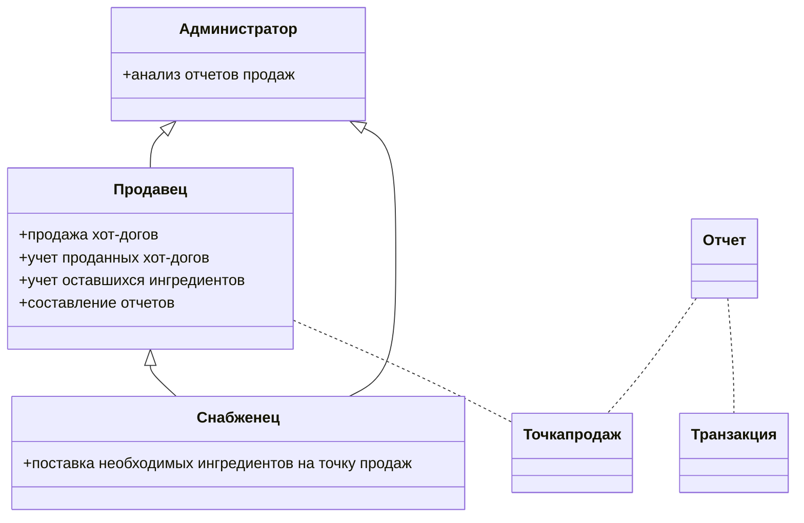

# [Hot Diggety Dog](https://nealford.com/katas/kata?id=HotDiggetyDog)

## Бизнес контекст
Владелец местных ларьков с хот-догами хочет обзавестить системой для управления торговыми точками.

**Пользователи**: ~50 продавцов

**Требования**:
- система должна работать на небольших устройствах (меньше ноутбука), чтобы его можно было эффективно использовать на мобильных точках продаж
- в системе можно делать скидки
- сохраняет время и место продажи каждого хот-дога
- отправляет уведомления сотрудникам, отвечающим за пополнение запасов точек продаж
- интегрировано с соц. сетями, чтобы можно было уведомлять клиентов когда они находятся вблизи точек продаж
- может выгружать отчеты в формате, который умеет читать бухгалтерское ПО

**Дополнительный контекст**:
- вынуждены заняться разработкой, потому что текущие способы отслеживания продаж требуют слишком много ручного труда
- нужно разработать как можно быстрее
- однако, важнее будет разработать систему так, чтобы ее не надо было переписывать в течение 3-х лет
- ограничений по бюджету нет

## Внимание

Данный кейс уже был рассмотрен ранее ([тут](otus-arch/homeworks/july/1/homework.md)).\
Было найдено два архитектурных решения, одно из которых предполагает разработку системы с нуля.\
На нем и будет сконцентрирована данная ADR.

## Модели предметной области
Владельцу бизнеса нужно чтобы:
- создание отчетов продавцов хот-догов было автоматизировано 
- работа менеджеров по снабжению была упрощена
- была административная панель для отчетов

В модели предметной области можно выделить следующие сущности:

## Функциональная декомпозиция

В данном случае ярко выражены три сущности, поэтому я предварительно декомпозирую все решение по ним на три контекста:
- контекст продавца
- контекст снабженца
- контекст администратора

