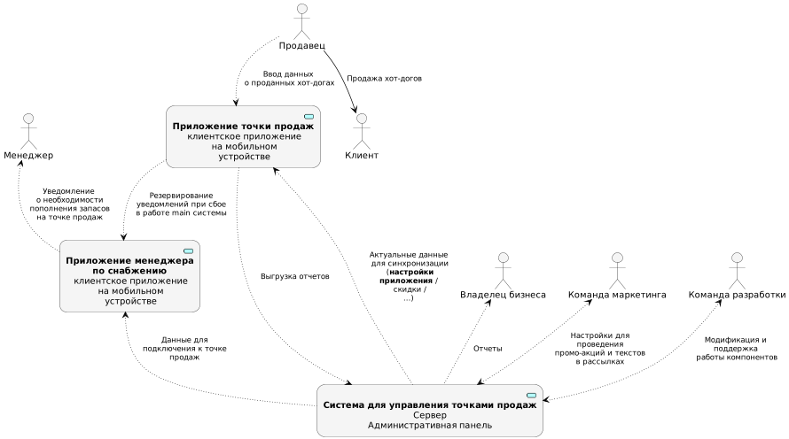

# [Hot Diggety Dog](https://nealford.com/katas/kata?id=HotDiggetyDog)

## Бизнес контекст
Владелец местных ларьков с хот-догами хочет обзавестить системой для управления торговыми точками.

**Пользователи**: ~50 продавцов

**Требования**:
- система должна работать на небольших устройствах (меньше ноутбука), чтобы его можно было эффективно использовать на мобильных точках продаж
- в системе можно делать скидки
- сохраняет время и место продажи каждого хот-дога
- отправляет уведомления сотрудникам, отвечающим за пополнение запасов точек продаж
- интегрировано с соц. сетями, чтобы можно было уведомлять клиентов когда они находятся вблизи точек продаж
- может выгружать отчеты в формате, который умеет читать бухгалтерское ПО

**Дополнительный контекст**:
- вынуждены заняться разработкой, потому что текущие способы отслеживания продаж требуют слишком много ручного труда
- нужно разработать как можно быстрее
- однако, важнее будет разработать систему так, чтобы ее не надо было переписывать в течение 3-х лет
- ограничений по бюджету нет

## Бизнес-цели и бизнес-драйверы

### Бизнес-драйверы
- отчеты о проданных хот-догах пишутся вручную, что приводит к расхождению в цифрах
- расхождение в цифрах приводит к неоптимальному использованию бюджета
- из-за того что учет ведется вручную, менеджеры по снабжению не могут своевременно производить закупку и последующую доставку товаров, что потенциально приводит к сбоям и простоям в цепи поставок
- из-за сбоев в поставках растут очереди на точках продаж, что ухудшает рейтинг сети по продаже хот-догов
- снижение рейтинга бьет по количеству продаж и цене акций компании

### Бизнес цели
Как можно скорее разработать систему учета, которая сократит количество ручного труда и будет удовлетворять требуемым качествам.\
Компания хочет разработать надежную и высокопроизводительную систему для носимых устройств, которая обеспечит устойчивый рост бизнеса.

## Стейкхолдеры и их потребности
Заинтересованные стороны, ключевые участники:
- Продавец - сотрудник компании, который продает хот-доги на мобильной точке продаж и ведет учет
- Менеджер - сотрудник компании, своевременно пополняющий запасы мобильных точек продаж
- Клиент - человек, который (хочет купить / купил / покупает) хот-дог
- Владелец бизнеса - предприниматель, который заинтересован в увеличении количества продаж и ускорении роста своего бизнеса
- Команда маркетинга - люди, отвечающие за продвижение бренда в соц. сетях
- Команда разработки - системные администраторы / разработчики / проектные менеджеры / тестировщики

Потребности:
- оптимизация расходов за счет:
  - автоматизации процессов
  - снижения влияния человеческого фактора на учет проданных хот-догов
  - определения лучших точек для продажи хот-догов
- ускорение продаж за счет
  - своевременного пополнения запасов
  - привлечения клиентов поблизости через соц. сети

## Пользовательские истории
UC-0: Подготовка к началу продаж:
- каждый рабочий день продавец хот-догов берет устройство с установленным приложением с собой и едет на точку продаж
- перед тем как начать продажи, продавец пересчитывает имеющиеся ингредиенты и заводит полученные данные в приложение (для автоматизации процесса учета, каждую точку продаж можно оснастить весами под каждый лоток с ингредиентами и интегрировать сбор данных в приложение)

UC-1: Пользовательское обслуживание:
- при каждом заказе продавец отмечает в приложении тип и количество проданных хот-догов
- количество использованных ингредиентов учитывается исходя из типа и количества проданных хот-догов

UC-2: Пополнение запасов мобильной точки продаж:
- менеджеры, отвечающие за пополнение запасов, получают уведомления от точек продаж когда количество оставшихся ингредиентов переходит за установленное пороговое значение
- пороговое значение выставляется динамически, опираясь на статистические данные по количеству продаж в текущей локации и по времени, или вручную администратором / командой маркетинга

UC-3: Привлечение клиентов:
- в случае низкой загруженности точек продаж, приложение рассылает рекламные уведомления пользователям поблизости
- в случае появления конкурентов вблизи точки продаж, в приложении можно установить дисконт на стоимость хот-догов

## Атрибуты качества
- приложение, должно быть легковесным и запускаться на любом носимом устройстве из списка (список устройств оговаривается отдельно)
- приложение, должно быть высокодоступным, поскольку перебои в работе отрицательно скажутся на бизнесе
- задержка отправки уведомления менеджеру по снабжению не должно превышать 10 минут при низкой нагрузке на точку продаж со стороны покупателей и 1 минуту в "часы пик"
- потерянных заказов и отчетов быть не должно
- промежуточные отчеты должны храниться на устройстве и при наличии доступа к сети резервироваться
- формирование отчетов должно выполняться в фоне, чтобы не занимать время продавца
- отчеты должны создаваться в формате, в котором их сможет распарсить бухгалтерское ПО
- продавцы и менеджеры по снабжению не должны иметь доступ на чтение, редактирование и удаление отчетов
- приложение продавца должно использовать все возможные каналы связи, чтобы быть в контакте с приложением менеджера по снабжению

## [Контекстная схема](./context_scheme.puml)

## Критичные сценарии и критичные характеристики
**Критичные сценарии**:
- продавцы используют приложение на любом мобильном устройстве из списка (список устройств оговаривается отдельно)
- продавцы отмечают в приложении количество и тип проданных хот-догов
- отчеты о продажах создаются автоматически, основываясь на данных, полученных от продавцов
- менеджеры снабжения получают уведомления от точек продаж, когда запасы опустели ниже установленного значения
- продавцы привлекают клиентов поблизости, рассылая уведомления в соц. сетях / пуши или устанавливая скидки

**Критичные характеристики**:
- время разработки (time to market)
- система запускается на мобильных устройствах
- доступность системы и базы данных
- надежность: не должно быть утерянных отчетов
- модифицируемость: система должна быть универсальна настолько, чтобы ее можно было легко обогащать новыми сущностями, важными для бизнеса, без внесения изменений в коде

Из них можно выделить две важных характеристики:
- Скорость разработки (time to market)
- Надежность

## Архитектурное решение. Альтернативы
На основании контекста и бизнес сценария сфокусируемся на тех альтернативах, 
которые сильнее всего влияют на время разработки и работу приложения на мобильных устройствах:
1. готовая касса с учетной системой [iiko](https://iiko.ru/solutions/products/price)
2. собственная система с приложениями, написанными под текущие требования

## Оценка архитектурных решений

### Архитектурное решение 1.
Готовая касса на планшете и учет в облаке

Скорость разработки:
- быстро, поскольку не надо разрабатывать, достаточно сконфигурировать и использовать
- [система уведомлений](https://ru.iiko.help/articles/#!iikoweb/subscription) уже реализована, поэтому дополнительных доработок не требуется

Надежность:
- модификации проводятся за счет вендора, в течение 3-х лет система будет актуальна, если у бизнеса резко не сменится курс
- зависит от архитектуры приложений вендора, поэтому не понятно, насколько система отказоустойчива, и что с резервированием отчетов

### Архитектурное решение 2.
Собственная система с приложениями, написанными под текущие требования

Скорость разработки:
- поиск людей в команду разработки занимает время
- разработка с нуля системы и приложений может быть длительной

Надежность:
- если система и приложения написаны с учетом всех требований, и команда разработки состоит из опытных специалистов, все ок :)

## Сравнительная оценка альтернатив
Качественная сравнительная оценка архитектурных решений:

**A-IIKO**\
скорость: TT\
надежность: DD

**A-DEV**\
скорость: T\
надежность: DD

> T - TTM \
D - Durability

Базовый вариант A-IIKO кажется самым подходящим в текущей ситуации
Для него необходимо проработать риски:
- Узнать, сколько будет стоить тариф для бизнеса текущего размера
- Узнать возможно ли делать интеграции силами разработчиков iiko при возникновении такой потребности
- Узнать, как настроить отправку уведомлений менеджерам по снабжению в iiko или найти специалиста, который настроит
