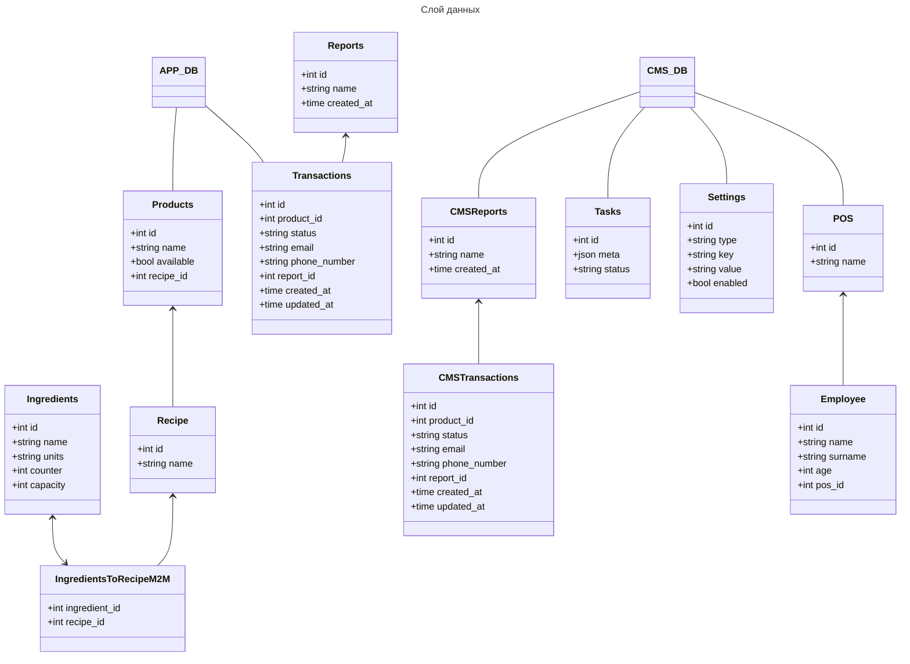
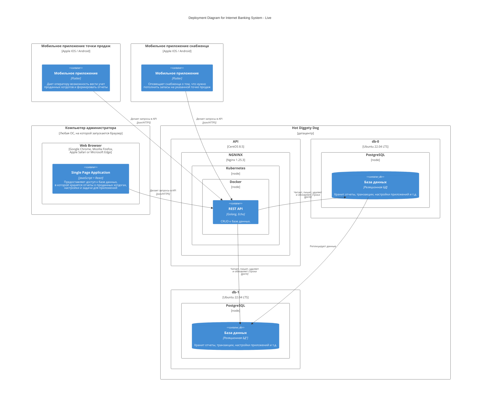

# [Hot Diggety Dog](https://nealford.com/katas/kata?id=HotDiggetyDog)

## Бизнес контекст

Владелец местных ларьков с хот-догами хочет обзавестить системой для управления торговыми точками.

**Пользователи**: ~50 продавцов

**Требования**:

- система должна работать на небольших устройствах (меньше ноутбука), чтобы его можно было эффективно использовать на
  мобильных точках продаж
- в системе можно делать скидки
- сохраняет время и место продажи каждого хот-дога
- отправляет уведомления сотрудникам, отвечающим за пополнение запасов точек продаж
- интегрировано с соц. сетями, чтобы можно было уведомлять клиентов когда они находятся вблизи точек продаж
- может выгружать отчеты в формате, который умеет читать бухгалтерское ПО

**Дополнительный контекст**:

- вынуждены заняться разработкой, потому что текущие способы отслеживания продаж требуют слишком много ручного труда
- нужно разработать как можно быстрее
- однако, важнее будет разработать систему так, чтобы ее не надо было переписывать в течение 3-х лет
- ограничений по бюджету нет

## Внимание

Данный кейс уже был рассмотрен ранее ([тут](otus-arch/homeworks/july/1/homework.md),
и [тут](otus-arch/homeworks/august/1/homework.md), и [тут](otus-arch/homeworks/september/1/homework.md)).\
Было найдено два архитектурных решения, одно из которых предполагает разработку системы с нуля.\
При разработке системы с нуля, были выбраны следующие контексты:

- контекст продавца
- контекст снабженца
- контекст администратора

Каждый контекст предполагает разработку отдельного сервиса.
На диаграмме контейнеров приложения, структур хранения данных в бд и деплоймент диаграмме и будет сконцентрирована
данная ADR.

## Диаграмма контейнеров приложения на основе выбранной модели функциональной декомпозиции

## Декомпозиция слоя данных: какие данные в каких БД хранятся

## Деплоймент диаграмма
