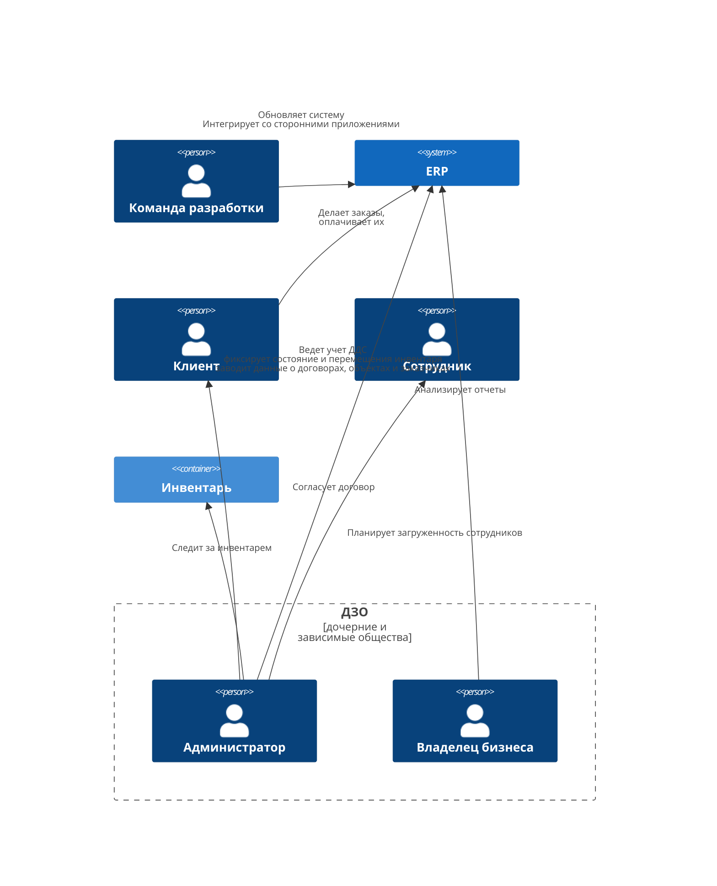
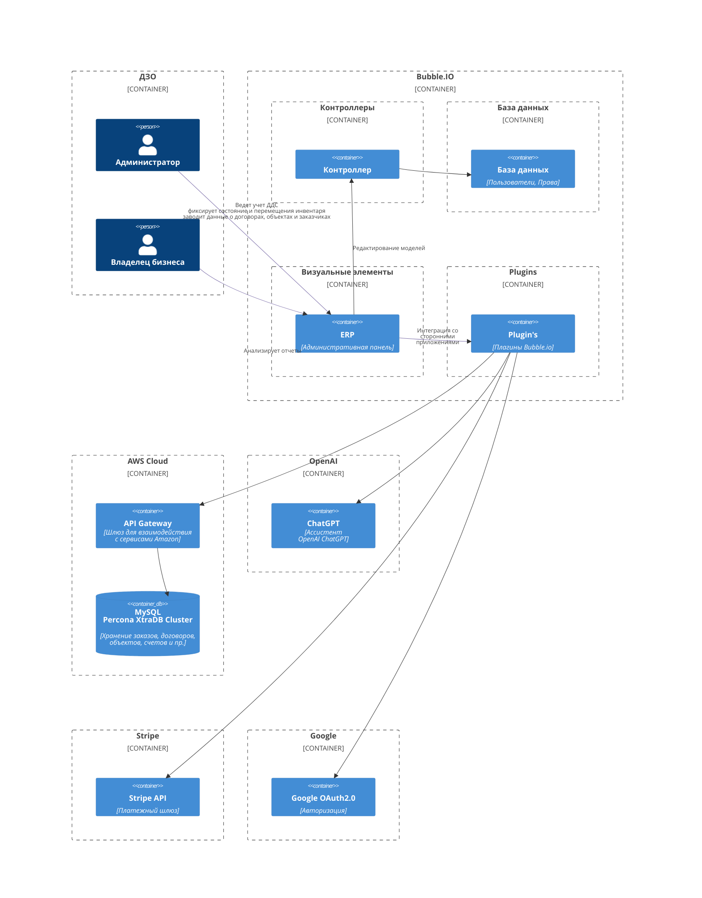
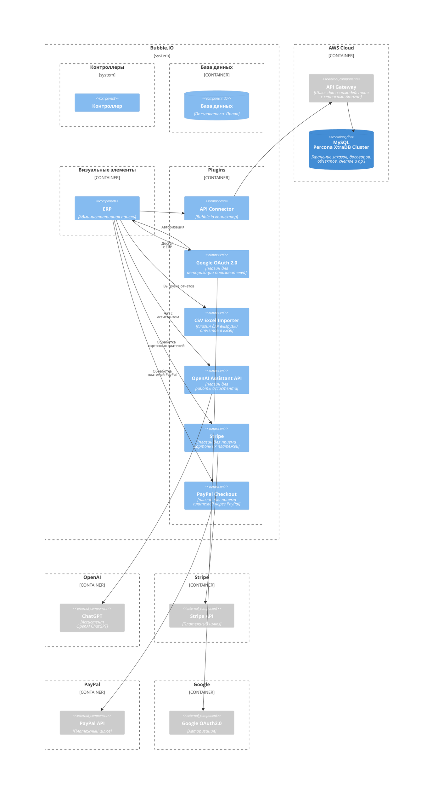
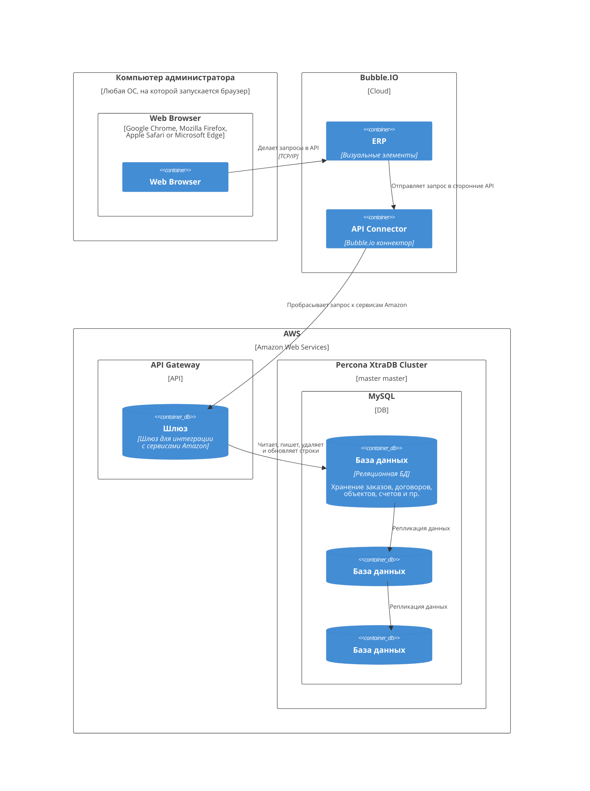

# Low-Code ERP для мебельного бизнеса

## Бизнес контекст
Владелец мебельного бизнеса хочет обзавестись ERP системой.

**Пользователи**: >100 компаний с размером команд от 15 человек

**Требования**:
- система должна работать на ПК (также, желательно чтобы работала на мобильных устройствах)
- есть возможность:
  - составлять отчеты о ДДС (движении денежных средств)
  - выгружать отчеты в Excel
  - хранить договоры, контакты заказчиков, счета
  - хранить список сотрудников и графики их работы
  - вести учет инвентаря
  - планировать периодические платежи
  - предоставлять клиентам форму для оплаты (интегрировать карточный платежный шлюз, PayPal)
- к системе будут подключаться партнеры, поэтому нужно сделать разделение по правам доступа
- необходим встроенный ассистент, который бы отвечал на большинство рабочих вопросов

**Дополнительный контекст**:
- вынуждены заняться разработкой, потому что текущие способы ведения учета требуют слишком много ручного труда
- нужно разработать как можно быстрее
- ограничений по бюджету нет

## Бизнес-цели и бизнес-драйверы

### Бизнес-драйверы
- отчеты ДДС пишутся в excel таблицах, что время от времени приводит к расхождению в цифрах
- расхождение в цифрах приводит к неоптимальному использованию бюджета
- количество excel таблиц растет в геометрической прогресии, их тяжело поддерживать в едином виде 

### Бизнес цели
Разработать ERP, которая сократит количество ручного труда и будет удовлетворять требуемым качествам.\
Компания хочет разработать систему, которая обеспечит устойчивый рост бизнеса.

## Стейкхолдеры и их потребности
Заинтересованные стороны, ключевые участники:
- Мастер - сотрудник компании, который создает предметы мебели
- Менеджер - сотрудник компании, который следит за ДДС, инвентарем на складе, загруженностью персонала
- Клиент - человек, который (хочет купить / купил / покупает) предметы мебели
- Владелец бизнеса - предприниматель, который заинтересован в увеличении количества продаж и ускорении роста своего бизнеса
- Команда разработки - системные администраторы / разработчики / проектные менеджеры / тестировщики

Потребности:
- оптимизация расходов за счет:
  - автоматизации процессов
  - снижения влияния человеческого фактора на учет проданных предметов мебели
- ускорение продаж за счет
  - планирования бюджета и отслеживанием состояния инвентаря на складе
- объединение в одной системе всех отчетов партнеров

## Бизнес ограничения
Реализовать систему необходимо очень быстро и сделать максимально гибкой, чтобы ее можно было легко дорабатывать.
Компания не может держать в штате разработчика постоянно, но готова время от времени нанимать специалиста на небольшие задачи. 
Поэтому, имеет смысл:
- или использовать готовую ERP (если это дешево относительно разработки системы с нуля)
- или разрабатывать систему инкрементально, чтобы каждый новый внедряемый функционал не аффектил уже имеющийся
- или воспользоваться Low-Code Serverless решением

## Технологические ограничения
В связи с ограничениями описанными выше, система должна быть написана:
- на популярном языке программирования, чтобы не возникало трудностей с поиском разработчика
- с использованием популярного фреймворка, чтобы найденный разработчик быстро погрузился в курс дела

Поскольку пользователями приложения является большое количество компаний, систему должна быть отказоустойчивой под высокой нагрузкой.

## Пользовательские истории
UC-0: Отслеживание движения денежных средств:
- менеджер согласовывает договор с клиентом и после подписания фиксирует планируемый прием денежных средств (в последствии ДС) от покупателя в системе
- при покупке какого-либо инвентаря/ремонте чего-либо, менеджер фиксирует расходы в системе

UC-1: Логгирование загруженности персонала:
- менеджер следит за рабочим временем сотрудников и отмечает в системе когда сотрудник отсутствовал без уважительной причины (не edge-case, а очень частая ситуация)

UC-2: Учет инвентаря:
- менеджер фиксирует все перемещения инвентаря (на складе, на работе, в заточке...) в системе

UC-3: Ассистент ERP:
- менеджер открывает чат в ERP и получает полезную информацию от ассистента (ChatGPT)

UC-4: Разделение прав доступа:
- менеджер партнерской компании видит в ERP только свои договоры, отчеты, инвентарь и т.д.

UC-5: Хранение фото предметов мебели и инвентаря:
- менеджер сохраняет фото мебели и инвентаря в карточках предметов в ERP

## Атрибуты качества
- приложение, должно запускаться на любом ПК (опционально, но не обязательно - на носимом устройстве)
- приложение, должно быть высокодоступным, поскольку перебои в работе отрицательно скажутся на бизнесе
- потерянных договоров и отчетов быть не должно
- отчеты должны импортироваться в формате csv / excel
- личные кабинеты компаний должны быть разделены
- в ERP должен быть чат с ChatGPT ботом
- в ERP должна быть возможность сохранять фото предметов мебели и инвентаря

## Контекстная схема

## Критичные сценарии и критичные характеристики
**Критичные сценарии**:
- менеджеры используют приложение на ПК
- менеджеры ведут в системе учет движения денежных средств
- менеджеры фиксируют в системе все перемещения инвентаря

**Критичные характеристики**:
- система запускается на ПК
- доступность системы и базы данных
- надежность: не должно быть утерянных отчетов
- модифицируемость: система должна быть универсальна настолько, чтобы ее можно было легко обогащать новыми сущностями, важными для бизнеса, без внесения изменений в коде

Из них можно выделить три важных характеристики:
- Скорость реализации (TTM)
- Надежность
- Модифицируемость

## Архитектурное решение. Альтернативы
На основании контекста и бизнес сценария сфокусируемся на тех альтернативах, 
которые сильнее всего влияют на время разработки и работу приложения на мобильных устройствах:
1. готовая self-hosted ERP [erpnext](https://github.com/frappe/erpnext) система, написанная [на самом популярном языке программирования - Python](https://www.tiobe.com/tiobe-index/) по рейтингу TIOBE на 2023 год
2. собственная система с моделью данных, написанной под текущие требования
3. Low-Code ServerLess решение

## Оценка архитектурных решений

### Архитектурное решение 1.
Готовая self-hosted ERP - [ERPNext](https://erpnext.com)

Скорость разработки:
- молниеносно, поскольку ничего не надо разрабатывать, достаточно сконфигурировать, купить хостинг и запустить приложение на арендованной машине
- однако нужен специалист, который задеплоит всю систему и настроит ее. Поиск специалиста занимает какое-то время
- для дальнейшей поддержки/разработки потребуется дополнительное время на то чтобы разработчик разобрался в устройстве системы

Надежность:
- судя по количеству звезд и решенных проблем и коммитам на github, видно что проект активно и успешно развивается
- проект опенсорсный и если возникнет баг, сообщество будет его фиксить, но гарантии что фикс будет сделан в кратчайшие сроки - нет

Модифицируемость:
- зависит от опытности разработчика, который будет вносить изменения в ERP

### Архитектурное решение 2.
Собственная система, написанная под текущие требования

Скорость разработки:
- поиск разработчика занимает время
- разработка с нуля системы и приложений может быть длительной

Надежность:
- если система и приложения написаны с учетом всех требований, и команда разработки состоит из опытных специалистов, все ок :)

Модифицируемость:
- зависит от опытности разработчика, который "закладывал фундамент" ERP 

### Архитектурное решение 3.
Реализовання на Low-Code платформе https://bubble.io ERP

Скорость разработки:
- скорость коллосальная, все формы и интерфейсы могут быть созданы за считанные дни

Надежность:
- высокая, поскольку при покупке лицензии разработчик получает поддержку 24/7, готовую решить любые проблемы

Модифицируемость:
- крайне высокая

## Сравнительная оценка альтернатив
Качественная сравнительная оценка архитектурных решений:

**A-ERPNEXT**\
скорость: T\
надежность: D\
модифицируемость: U

**A-DEV**\
скорость: T\
надежность: D\
модифицируемость: U

**A-BUBBLE.IO**\
скорость: TTT\
надежность: DDD\
модифицируемость: UUU

> T - TTM \
D - Durability\
U - Upgradability

---

Вариант разработки ERP с использованием LowCode платформы выглядит самым привлекательным. На нем и будет сконцентрирован данный ADR.

## Контекстная диаграма

## Диаграмма контейнеров

## Диаграмма компонентов

## Диаграмма развертывания

Остальные приложения находятся вне нашей зоны контроля, поэтому на диаграмме развертывания их нет.

## Структура хранилища данных

