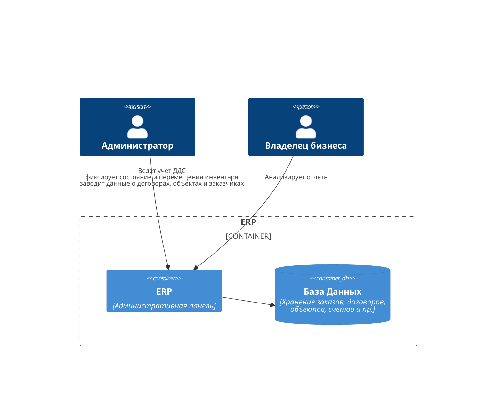
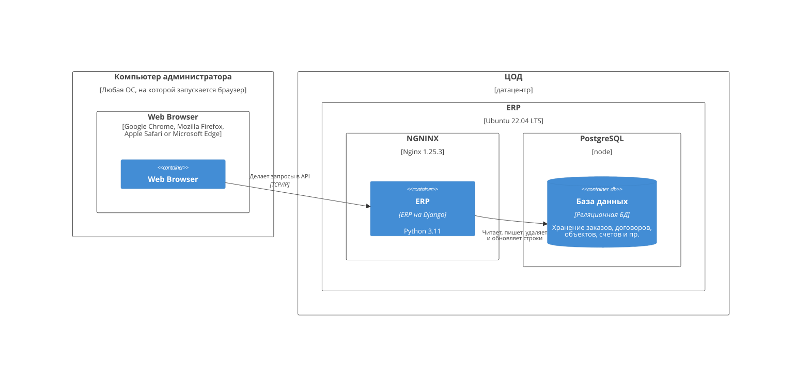
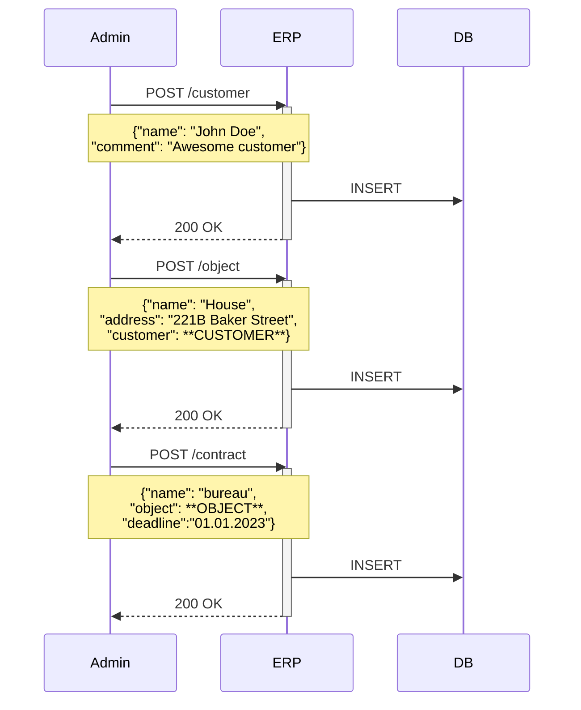
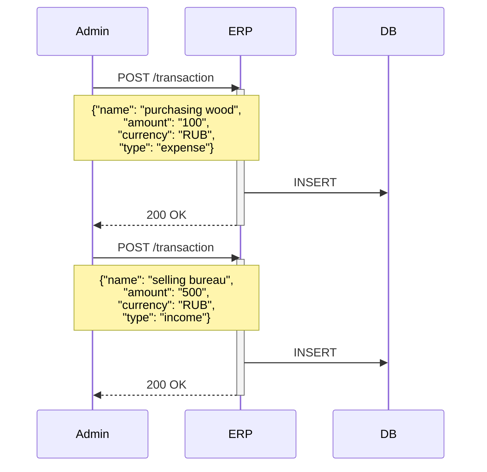
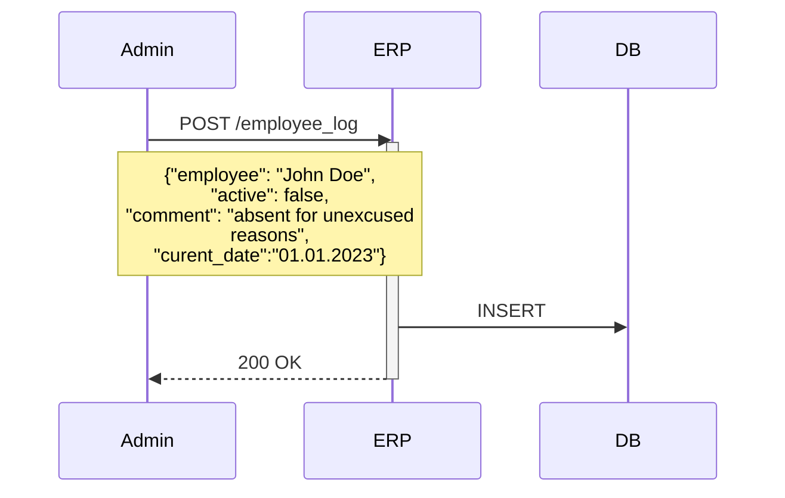
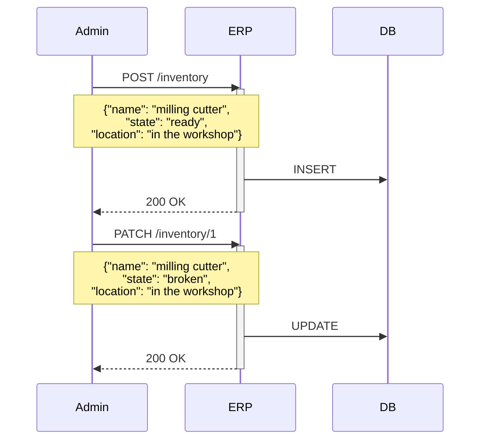

## Контекстная диаграма

## Диаграмма контейнеров

## Диаграмма развертывания

## Диаграммы последовательности для пользовательских сценариев

### Отслеживание движения денежных средств

Сохранение данных о согласованном договоре

Сохранение данных о приходе/расходе

## Логгирование загруженности персонала

## Учет инвентаря
