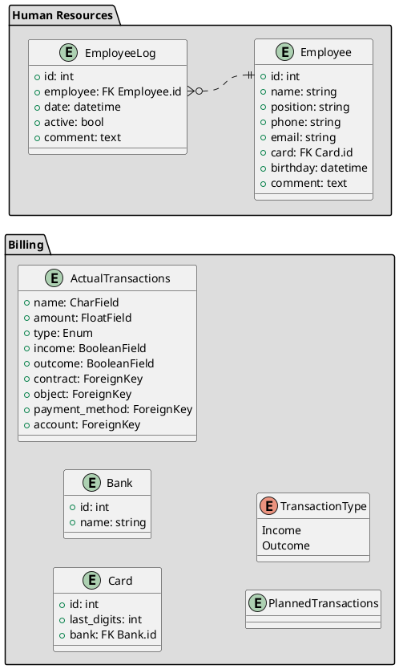

## Структура базы данных

```plantuml

@startuml

left to right direction

package "Human Resources" #DDDDDD {

    entity "Employee" as e {
        + id: int
        + name: string
        + position: string
        + phone: string
        + email: string
        + card: FK Card.id
        + birthday: datetime
        + comment: text
    }

    entity "EmployeeLog" as el {
        + id: int
        + employee: FK Employee.id
        + date: datetime
        + active: bool
        + comment: text
    }

   e::id ||.up.o{ el::employee
}

package "Billing" #DDDDDD {

    entity "Card" as c {
        + id: int
        + last_digits: int
        + bank: FK Bank.id
    }
    
    entity "Bank" as b {
        + id: int
        + name: string
    }
    
    entity ActualTransactions {
        + name: CharField
        + amount: FloatField
        + type: Enum
        + income: BooleanField
        + outcome: BooleanField
        + contract: ForeignKey
        + object: ForeignKey
        + payment_method: ForeignKey
        + account: ForeignKey
    }
    
    entity PlannedTransactions {
    }
    
    enum TransactionType {
        Income
        Outcome
    }

}

@enduml


```