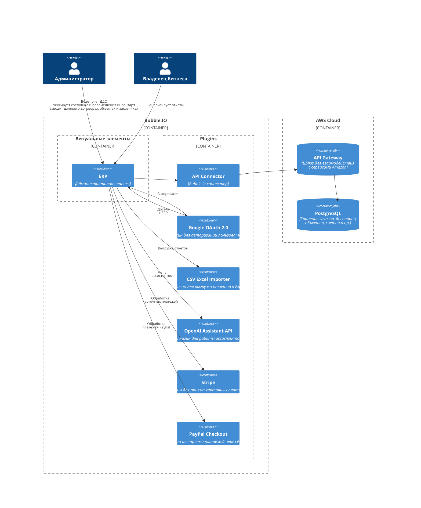
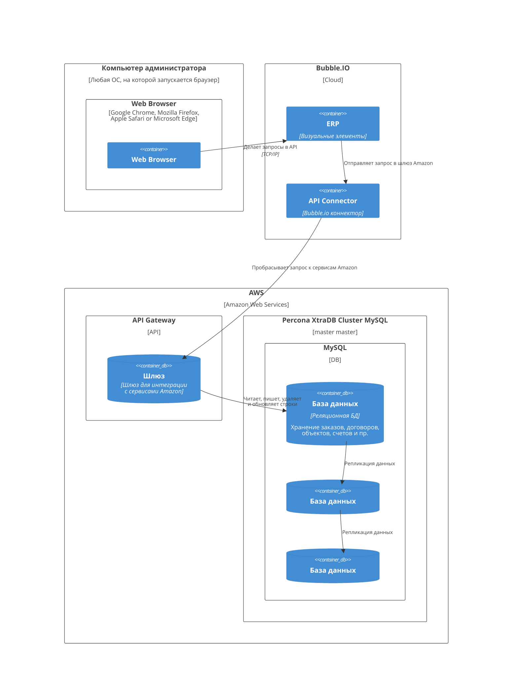

## Контекстная диаграма

## Диаграмма контейнеров

```mermaid
C4Container
    Container_Boundary(erp, "Bubble.IO") {
        Container_Boundary(b_visual, "Визуальные элементы") {
            Container(admin_pannel, "ERP", "Административная панель")
        }
        Container_Boundary(plugins, "Plugins") {
            Container(connector, "API Connector", "Bubble.io коннектор")
            Container(auth, "Google OAuth 2.0", "плагин для авторизации пользователей")
            Container(csv_import, "CSV Excel Importer", "плагин для выгрузки отчетов в Excel")
            Container(openai, "OpenAI Assistant API", "плагин для работы ассистента")
            Container(stripe, "Stripe", "плагин для приема карточных платежей")
            Container(paypal, "PayPal Checkout", "плагин для приема платежей через PayPal")
        }
    }
    
    Container_Boundary(aws, "AWS Cloud") {
        ContainerDb(gateway, "API Gateway", "Шлюз для взаимодействия <br>с сервисами Amazon")
        ContainerDb(postgre, "PostgreSQL", "Хранение заказов, договоров, <br> объектов, счетов и пр.")
    }

    Person(admin, "Администратор", "")
    Person(business, "Владелец бизнеса", "")
    Rel(admin_pannel, connector, "")
    Rel(connector, gateway, "")
    Rel(gateway, postgre, "")
    Rel(admin, admin_pannel, "Ведет учет ДДС <br> фиксирует состояние и перемещения инвентаря <br> заводит данные о договорах, объектах и заказчиках")
    Rel(business, admin_pannel, "Анализирует отчеты")
    Rel(admin_pannel, auth, "Авторизация")
    Rel(auth, admin_pannel, "Доступ <br>к ERP")
    Rel(admin_pannel, csv_import, "Выгрузка отчетов")
    Rel(admin_pannel, openai, "Чат с <br>ассистентом")
    Rel(admin_pannel, stripe, "Обработка <br>карточных платежей")
    Rel(admin_pannel, paypal, "Обработка <br>платежей PayPal")

    UpdateRelStyle(admin, admin_pannel, $offsetY="-70", $offsetX="-150")
    UpdateRelStyle(business, admin_pannel, $offsetY="-70", $offsetX="40")
    UpdateRelStyle(admin_pannel, auth, $offsetY="-30", $offsetX="0")
    UpdateRelStyle(auth, admin_pannel, $offsetY="30", $offsetX="0")
    UpdateRelStyle(admin_pannel, csv_import, $offsetY="70", $offsetX="0")
    UpdateRelStyle(admin_pannel, openai, $offsetY="70", $offsetX="-20")
    UpdateRelStyle(admin_pannel, stripe, $offsetY="70", $offsetX="-50")
    UpdateRelStyle(admin_pannel, paypal, $offsetY="70", $offsetX="-50")
```

## Диаграмма развертывания

```mermaid
C4Deployment
    Deployment_Node(comp, "Компьютер администратора", "Любая ОС, на которой запускается браузер") {
        Deployment_Node(browser, "Web Browser", "Google Chrome, Mozilla Firefox,<br/> Apple Safari or Microsoft Edge") {
            Container(client, "Web Browser", "", "")
        }
    }

    Deployment_Node(plc, "Bubble.IO", "Cloud") {
        Container(api, "ERP", "Визуальные элементы")
        Container(connector, "API Connector", "Bubble.io коннектор")
    }
    
    Deployment_Node(aws, "AWS", "Amazon Web Services"){
        Deployment_Node(a_gateway, "API Gateway", "API") {
            ContainerDb(gateway, "Шлюз", "Шлюз для интеграции <br>с сервисами Amazon")
        }
        Deployment_Node(cluster, "Percona XtraDB Cluster MySQL", "master master") {
            Deployment_Node(mysql_a, "MySQL", "DB") {
                ContainerDb(db, "База данных", "Реляционная БД", "Хранение заказов, договоров, <br> объектов, счетов и пр.")
                ContainerDb(db_1, "База данных")
                ContainerDb(db_2, "База данных")
            }
        }
    }

    Rel(client, api, "Делает запросы в API", "TCP/IP")
    Rel(api, connector, "Отправляет запрос в шлюз Amazon", "")
    Rel(connector, gateway, "Пробрасывает запрос к сервисам Amazon", "")
    Rel(gateway, db, "Читает, пишет, удаляет <br> и обновляет строки", "")
    Rel(db, db_1, "Репликация данных", "")
    Rel(db_1, db_2, "Репликация данных", "")
    
    UpdateRelStyle(connector, gateway, $offsetY="-50")
```

## Структура хранилища данных

