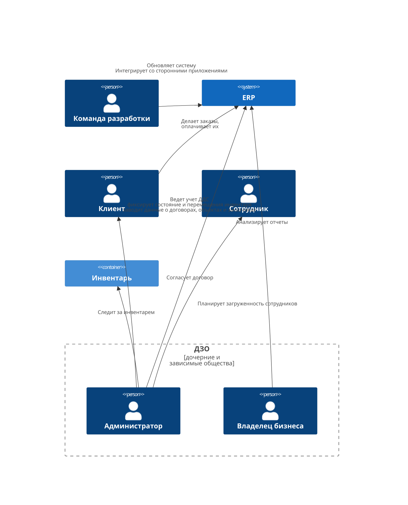
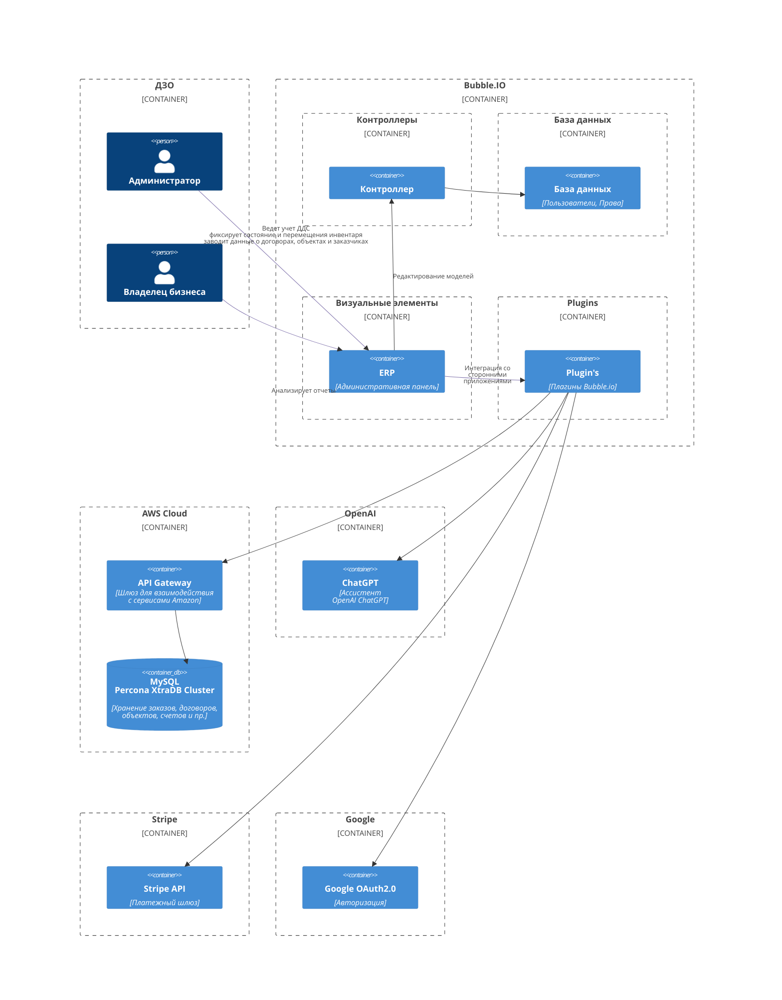
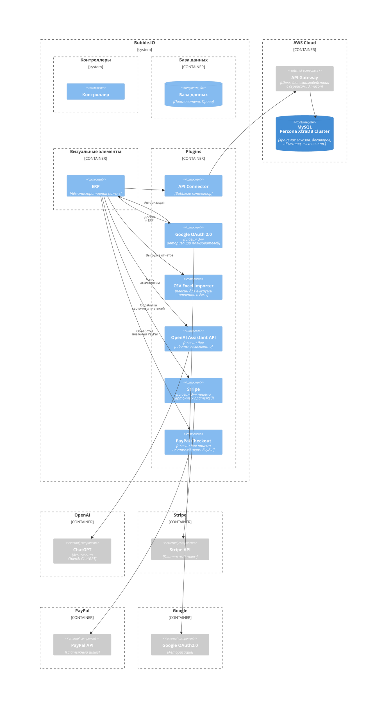

## Контекстная диаграма

## Диаграмма контейнеров

## Диаграмма компонентов

## Диаграмма развертывания

Остальные приложения находятся вне нашей зоны контроля, поэтому на диаграмме развертывания их нет.

## Структура хранилища данных

